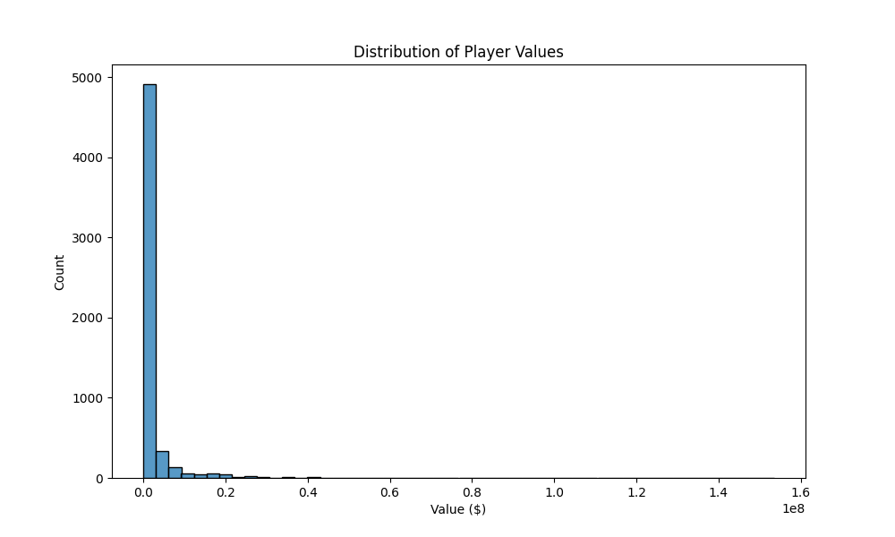
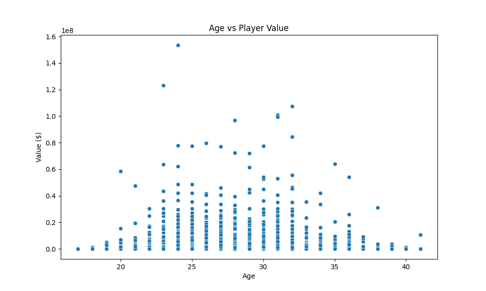
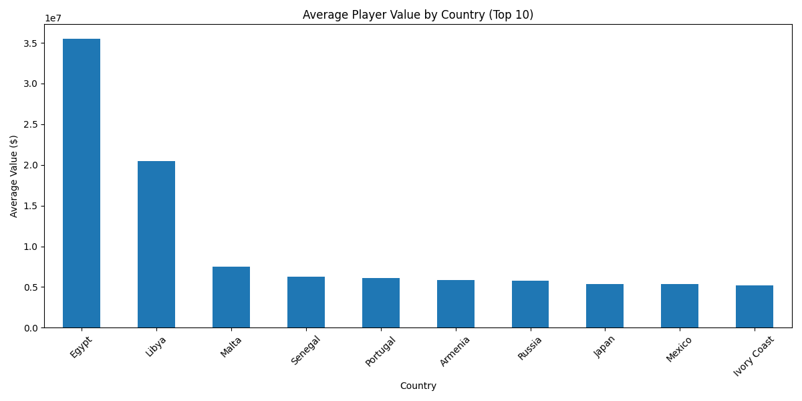
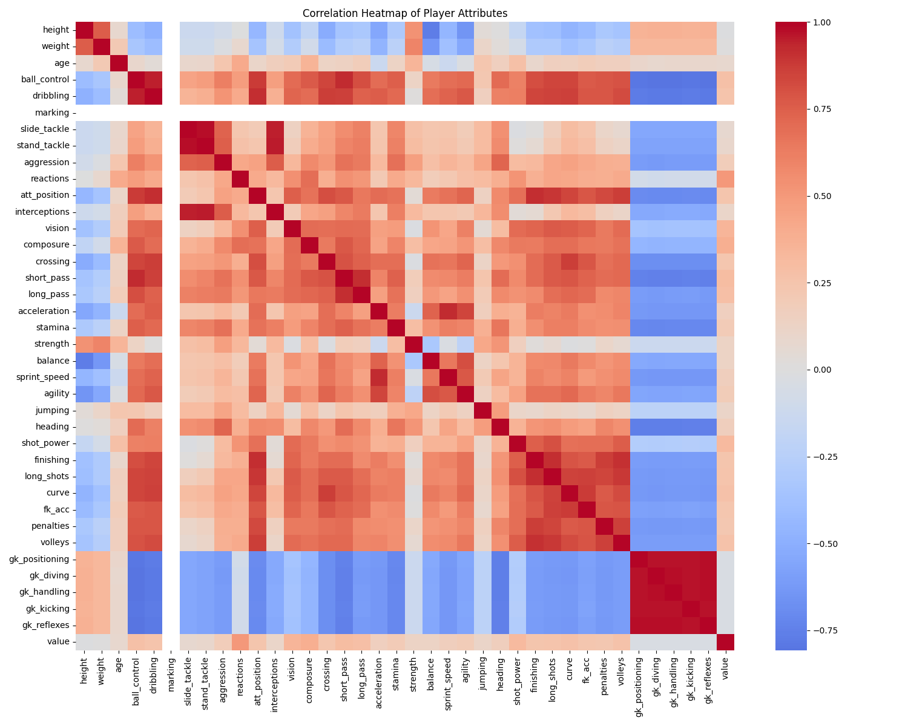

# FIFA Player Value Predictor

A machine learning web application that predicts a FIFA player's market value based on their attributes and characteristics.

## Features

- Predicts player value based on 36+ attributes
- User-friendly web interface
- Real-time predictions
- Input validation and error handling
- Beautiful Bootstrap-based UI

## Installation

1. Clone the repository:
   ```bash
   git clone https://github.com/arpitagarwaldev/fifa.git
   cd fifa
   ```

2. Create a Python virtual environment (recommended):
   ```bash
   python3 -m venv venv
   source venv/bin/activate  # On Windows: .\venv\Scripts\activate
   ```

3. Install the required packages:
   ```bash
   pip install -r requirements.txt
   ```

## Usage

1. Start the Flask application:
   ```bash
   python3 app.py
   ```

2. Open your web browser and navigate to:
   ```
   http://localhost:8080
   ```

3. Fill in the player attributes form:
   - Basic information (height, weight, age)
   - Technical skills (ball control, dribbling, etc.)
   - Physical attributes (stamina, strength, etc.)
   - Goalkeeper attributes (if applicable)

4. Click "Predict" to get the estimated player value

## Project Structure

```
.
├── app.py                # Flask application
├── artifacts/            # Model artifacts
│   ├── model.pkl         # Trained model
│   └── preprocessor.pkl   # Data preprocessor
├── src/
│   ├── components/       # Core components
│   ├── pipeline/         # Prediction pipeline
│   └── utils.py         # Utility functions
└── templates/           # HTML templates
```

## Exploratory Data Analysis

### Dataset Overview
- Total Players: 5,682
- Number of Countries: 135
- Number of Clubs: 689
- Average Player Age: 26.3 years

### Value Distribution
- Average Player Value: $2,244,827
- Median Player Value: $775
- Most Valuable Player: Kylian Mbappé ($153,500,000)

### Key Insights
Top 5 attributes most correlated with player value:
1. Reactions (0.50)
2. Composure (0.39)
3. Vision (0.35)
4. Shot Power (0.32)
5. Ball Control (0.31)

### Visualizations

#### Player Value Distribution

*The distribution of player values shows a strong right skew, indicating that while most players have relatively modest values, there are some extremely high-value outliers.*

#### Age vs Player Value

*Player values tend to peak in the mid-20s, with a decline in later years. However, there's significant variation at all ages.*

#### Top Countries by Average Player Value

*Shows the countries producing the most valuable players on average.*

#### Correlation Heatmap

*Visual representation of how different player attributes correlate with each other and with player value.*

## Model Information

- Uses CatBoost Regressor for prediction
- Features both numerical and categorical inputs
- Trained on FIFA player dataset with 5,682 players
- Handles missing values and feature scaling
- Key predictive features include reactions, composure, and vision

## Contributing

Contributions are welcome! Please feel free to submit a Pull Request.